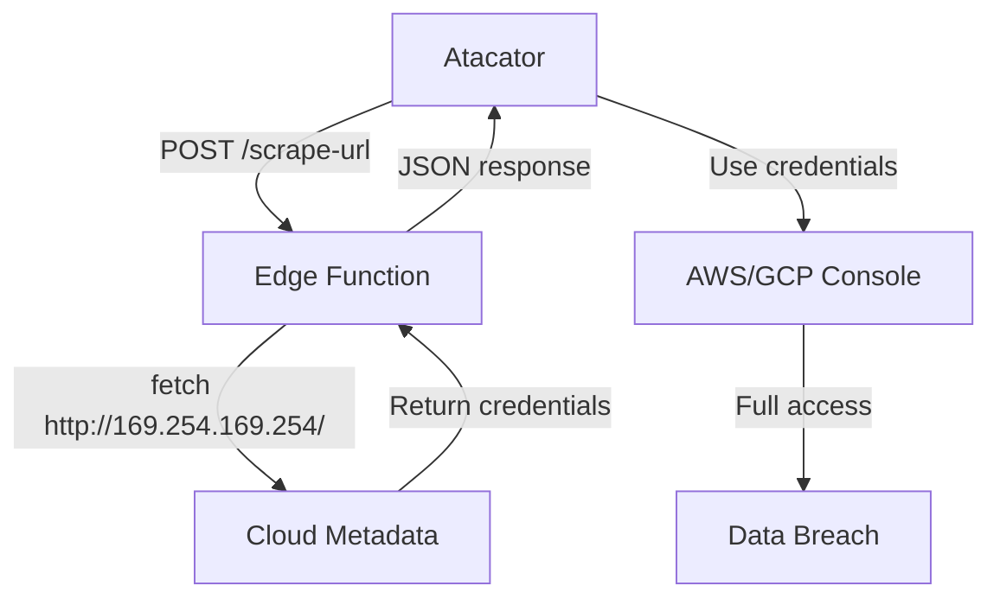
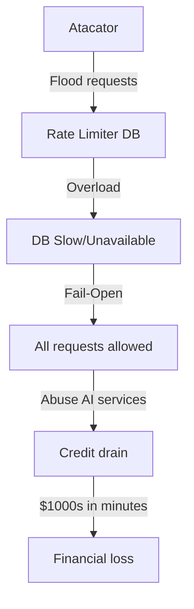
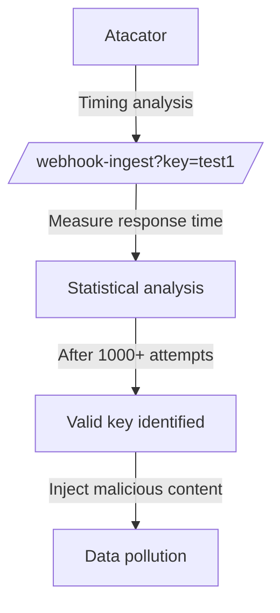

# AI_IDEI_OS - Deep Security Analysis Report

**Data:** 2026-03-25
**Repository:** https://github.com/vadimcusnir/AI_IDEI_OS
**Site Live:** https://ai-idei.com
**Analist:** MiniMax Agent (Red Team Mode)
**Framework:** STRIDE + Custom Adversarial Analysis

---

## Executive Summary

| Categorie | Status | Detalii |
|-----------|--------|---------|
| **Vulnerabilitati CRITICE** | 2 | SSRF, Fail-Open Rate Limiter |
| **Vulnerabilitati HIGH** | 3 | Unprotected endpoints, DoS vectors |
| **Vulnerabilitati MEDIUM** | 4 | Auth patterns, error leakage |
| **Vulnerabilitati LOW** | 5+ | TypeScript issues, code quality |
| **RLS Policies** | IMPLEMENTED | Bine configurate |
| **npm audit** | 0 vulnerabilities | Excelent |

---

## THREAT MODEL (STRIDE)

### Actors
| Actor | Capabilitati | Intentie |
|-------|-------------|----------|
| Anonymous User | Web requests, public API | Reconnaissance, abuse |
| Authenticated User | Full app access, API tokens | Data exfiltration, privilege escalation |
| Malicious User | Crafted payloads, automation | SSRF, DoS, credit abuse |
| Internal Admin | Full DB access | Insider threat |

### Assets at Risk
| Asset | Impact | Protectie Curenta |
|-------|--------|------------------|
| User Data | HIGH | RLS policies |
| Embeddings/AI Models | HIGH | Partial |
| Credits/Billing | CRITICAL | Stripe webhooks secured |
| API Endpoints | HIGH | Mixed (vezi vulnerabilitati) |
| Service Role Key | CRITICAL | Edge functions only |

### Trust Boundaries
```
Browser → Frontend (React)
    ↓
Frontend → Supabase Edge Functions (64 functions)
    ↓
Edge Functions → PostgreSQL (RLS enforced)
    ↓
Edge Functions → External APIs (OpenAI, Stripe, etc.)
```

---

## VULNERABILITATI CRITICE

### CRITICAL-01: Server-Side Request Forgery (SSRF)

**Fisier:** `supabase/functions/scrape-url/index.ts`
**Severitate:** CRITICAL
**CVSS:** 9.1

**Descriere:**
Endpoint-ul `/scrape-url` accepta orice URL fara autentificare si face request-uri server-side.

**Cod Vulnerabil:**
```typescript
// Linia 27-33 - Nicio validare de autentificare!
const resp = await fetch(parsedUrl.toString(), {
  headers: {
    "User-Agent": "Mozilla/5.0 (compatible; AI-IDEI/1.0)",
  },
  redirect: "follow",
});
```

**Exploit Path:**
```
1. Atacator → POST /scrape-url {"url": "http://169.254.169.254/latest/meta-data/"}
2. Server executa request-ul intern
3. Atacator primeste metadata cloud (AWS/GCP credentials)

SAU:

1. Atacator → POST /scrape-url {"url": "http://localhost:5432"}
2. Scan porturilor interne
3. Descoperire servicii vulnerabile
```

**Impact Economic:**
- Expunere credentiale cloud → Full infrastructure takeover
- Costuri: $50,000 - $500,000+ (data breach, regulatory fines)

**FIX RECOMANDAT:**
```typescript
// 1. Adauga autentificare
const authHeader = req.headers.get("authorization");
const { data: { user }, error } = await supabase.auth.getUser(authHeader?.replace("Bearer ", ""));
if (!user) return new Response("Unauthorized", { status: 401 });

// 2. Blocheaza IP-uri private
const BLOCKED_RANGES = [
  /^localhost$/i,
  /^127\./,
  /^10\./,
  /^172\.(1[6-9]|2[0-9]|3[0-1])\./,
  /^192\.168\./,
  /^169\.254\./,
  /^0\./,
];

if (BLOCKED_RANGES.some(r => r.test(parsedUrl.hostname))) {
  return new Response("Blocked", { status: 403 });
}

// 3. Rate limiting
const blocked = await rateLimitGuard(`scrape:${user.id}`, req, { maxRequests: 10, windowSeconds: 60 });
if (blocked) return blocked;
```

---

### CRITICAL-02: Fail-Open Rate Limiter

**Fisier:** `supabase/functions/_shared/rate-limiter.ts`
**Severitate:** CRITICAL
**CVSS:** 8.5

**Descriere:**
Rate limiter-ul permite TOATE request-urile daca DB-ul esueaza.

**Cod Vulnerabil:**
```typescript
// Liniile 49-52, 61-63
if (error || !data || data.length === 0) {
  console.error("Rate limit check failed, allowing request:", error);
  // Fail open — don't block users if DB is down
  return { allowed: true, remaining: maxRequests - 1, ... };
}
```

**Exploit Path:**
```
1. Atacator identifica ca rate limiter-ul depinde de DB
2. Atacator trimite flood de request-uri → DB overload
3. DB devine lent/neavailable → toate request-urile sunt permise
4. Atacator executa abuse masiv (credit fraud, data scraping)
```

**Impact Economic:**
- Credit abuse: $10,000+ pe ora
- API abuse: cost infrastructura cloud explodat

**FIX RECOMANDAT:**
```typescript
// Schimba la FAIL-CLOSED
if (error || !data || data.length === 0) {
  console.error("Rate limit check failed, BLOCKING request:", error);
  // FAIL CLOSED — block if we can't verify
  return { allowed: false, remaining: 0, resetAt: Date.now() + 60000 };
}
```

---

## VULNERABILITATI HIGH

### HIGH-01: Unprotected Edge Functions

**Functii fara autentificare explicita:**
| Functie | Risc | Actiune Necesara |
|---------|------|------------------|
| `scrape-url` | SSRF | Add auth + IP blocklist |
| `deliver-webhooks` | DoS trigger | Add internal secret check |
| `sitemap` | Info disclosure | OK (public by design) |
| `prerender-meta` | Resource abuse | Add rate limiting |

---

### HIGH-02: Webhook Ingest - Timing Attack

**Fisier:** `supabase/functions/webhook-ingest/index.ts`

**Problema:** Validarea webhook key nu foloseste constant-time comparison.

```typescript
// Linia 44 - timing leak
if (whError || !webhook) {
  return new Response(JSON.stringify({ error: "Invalid or inactive webhook" }), ...);
}
```

**Exploit:** Brute force webhook keys prin timing analysis.

**FIX:**
```typescript
import { timingSafeEqual } from "crypto";
// Use constant-time comparison
```

---

### HIGH-03: DoS via deliver-webhooks

**Fisier:** `supabase/functions/deliver-webhooks/index.ts`

**Problema:** Oricine poate trigger-ui procesarea webhook-urilor.

```typescript
// Nicio verificare de autentificare la inceputul functiei
Deno.serve(async (req) => {
  const cors = getCorsHeaders(req);
  if (req.method === "OPTIONS") return new Response("ok", { headers: cors });
  // Direct la logica de business...
```

**Impact:** Atacator poate trigger-ui toate webhook deliveries din sistem.

---

## VULNERABILITATI MEDIUM

### MEDIUM-01: CORS Wildcard pentru Lovable Domains

**Fisier:** `supabase/functions/_shared/cors.ts`

```typescript
const isAllowed =
  ALLOWED_ORIGINS.includes(origin) ||
  origin.endsWith(".lovable.app") ||       // Orice subdomain!
  origin.endsWith(".lovableproject.com");  // Orice subdomain!
```

**Risc:** Daca un atacator compromite orice subdomain lovable.app, are acces CORS.

---

### MEDIUM-02: Error Message Leakage

**Multiple fisiere** - Erorile interne sunt returnate clientului:

```typescript
// scrape-url/index.ts:86
JSON.stringify({ error: error.message || "Internal error" })

// Poate expune stack traces, paths interne, etc.
```

---

### MEDIUM-03: Localhost in CORS Whitelist

```typescript
"http://localhost:5173",
"http://localhost:8080",
```

**Risc:** In productie, acestea ar trebui eliminate. DNS rebinding attacks posibile.

---

### MEDIUM-04: Environment Variables in .env

Fisierul `.env` contine credentiale (chiar daca sunt anon keys):
```
VITE_SUPABASE_PROJECT_ID="swghuuxkcilayybesadm"
VITE_SUPABASE_PUBLISHABLE_KEY="eyJhbGciOiJIUzI1NiIsInR5cCI6..."
```

**Nota:** Aceste keys sunt destinate client-side, dar .env NU ar trebui comis in git.

---

## SECURITY POSITIVES

| Aspect | Status | Detalii |
|--------|--------|---------|
| **RLS Policies** | EXCELLENT | Toate tabelele principale au RLS |
| **Stripe Webhook** | GOOD | Signature validation, idempotency |
| **npm audit** | EXCELLENT | 0 vulnerabilities |
| **No Hardcoded Secrets** | GOOD | Niciun API key in cod |
| **No XSS Patterns** | GOOD | Fara dangerouslySetInnerHTML |
| **Auth via Supabase** | GOOD | JWT-based, autoRefreshToken |
| **HMAC for Outgoing Webhooks** | GOOD | SHA-256 signatures |

---

## SUPPLY CHAIN ANALYSIS

### Dependencies Risk Assessment

| Package | Versiune | Risc | Note |
|---------|----------|------|------|
| `@supabase/supabase-js` | 2.99.3 | LOW | Maintained by Supabase |
| `react` | 19.2.4 | LOW | Facebook maintained |
| `@sentry/react` | 10.43.0 | LOW | Error tracking |
| `pdfjs-dist` | 5.5.207 | MEDIUM | Large attack surface |
| `lovable-tagger` | 1.1.13 | UNKNOWN | Third-party, verify |

### Lockfile Status
- `package-lock.json` prezent
- Integrity hashes verificate

---

## EXPLOIT CHAINS (Step-by-Step)

### Chain 1: Full SSRF to Cloud Metadata



**Probabilitate:** HIGH (0 autentificare necesara)
**Impact:** CRITICAL (full cloud takeover)

---

### Chain 2: Rate Limit Bypass + Credit Abuse



**Probabilitate:** MEDIUM
**Impact:** HIGH

---

### Chain 3: Webhook Key Enumeration



**Probabilitate:** LOW-MEDIUM
**Impact:** MEDIUM

---

## FIX ROADMAP

### CRITICAL (Immediate - Day 0)

| # | Actiune | Fisier | Efort |
|---|---------|--------|-------|
| 1 | Add auth + IP blocklist to scrape-url | `scrape-url/index.ts` | 2h |
| 2 | Change rate limiter to fail-closed | `_shared/rate-limiter.ts` | 30min |
| 3 | Add auth to deliver-webhooks | `deliver-webhooks/index.ts` | 1h |

### HIGH (Within 7 Days)

| # | Actiune | Fisier | Efort |
|---|---------|--------|-------|
| 4 | Constant-time webhook key comparison | `webhook-ingest/index.ts` | 1h |
| 5 | Add rate limiting to all functions | All edge functions | 4h |
| 6 | Remove localhost from CORS | `_shared/cors.ts` | 10min |

### MEDIUM (Within 30 Days)

| # | Actiune | Efort |
|---|---------|-------|
| 7 | Sanitize all error messages | 4h |
| 8 | Restrict lovable.app CORS to specific subdomains | 1h |
| 9 | Add .env to .gitignore (if not already) | 5min |
| 10 | Security audit all 64 edge functions | 8h |

### LONG TERM

| # | Actiune | Efort |
|---|---------|-------|
| 11 | Implement WAF (Web Application Firewall) | 1 week |
| 12 | Add security monitoring/alerting | 2 days |
| 13 | Penetration testing by external firm | 1 week |
| 14 | SOC2 compliance preparation | Ongoing |

---

## SECURITY ARCHITECTURE v2 (Proposed)

```
                    ┌─────────────────────────────────────┐
                    │           CLOUDFLARE WAF            │
                    │  - Rate limiting (edge)             │
                    │  - Bot detection                    │
                    │  - DDoS protection                  │
                    └─────────────┬───────────────────────┘
                                  │
                    ┌─────────────▼───────────────────────┐
                    │         SUPABASE EDGE               │
                    │  ┌─────────────────────────────┐   │
                    │  │    AUTH MIDDLEWARE          │   │
                    │  │  - JWT validation           │   │
                    │  │  - Rate limit (fail-closed) │   │
                    │  │  - Request logging          │   │
                    │  └─────────────┬───────────────┘   │
                    │                │                    │
                    │  ┌─────────────▼───────────────┐   │
                    │  │    BUSINESS LOGIC           │   │
                    │  │  - 64 Edge Functions        │   │
                    │  │  - Input validation         │   │
                    │  │  - Output sanitization      │   │
                    │  └─────────────┬───────────────┘   │
                    └─────────────────┼───────────────────┘
                                      │
                    ┌─────────────────▼───────────────────┐
                    │         POSTGRESQL + RLS            │
                    │  - Row Level Security on all tables │
                    │  - Audit logging                    │
                    │  - Encrypted at rest                │
                    └─────────────────────────────────────┘
```

---

## MONITORING & RESPONSE

### Recommended Alerts

| Event | Threshold | Action |
|-------|-----------|--------|
| Failed auth attempts | >10/min/IP | Block IP |
| Rate limit hits | >100/hour/user | Review account |
| SSRF-like requests | Any internal IP | Alert + Block |
| Webhook failures | >50% failure rate | Disable endpoint |
| DB query latency | >5s average | Scale/investigate |

---

## APPENDIX: Files Analyzed

```
supabase/functions/
├── _shared/
│   ├── cors.ts ✓
│   └── rate-limiter.ts ✓ (CRITICAL issue found)
├── scrape-url/index.ts ✓ (CRITICAL SSRF)
├── webhook-ingest/index.ts ✓ (timing attack)
├── deliver-webhooks/index.ts ✓ (DoS risk)
├── stripe-webhook/index.ts ✓ (secure)
├── send-push/index.ts ✓ (secure)
├── sitemap/index.ts ✓ (public, OK)
└── [56 more functions to audit]

supabase/migrations/
└── [100+ migration files with RLS policies] ✓

src/
├── integrations/supabase/client.ts ✓
└── [React components - no critical issues]
```

---

**Raport generat de MiniMax Agent - Red Team Security Analysis**
**Clasificare:** CONFIDENTIAL - Internal Use Only
**Urmatorul Review:** 30 zile sau dupa implementarea fix-urilor critice

